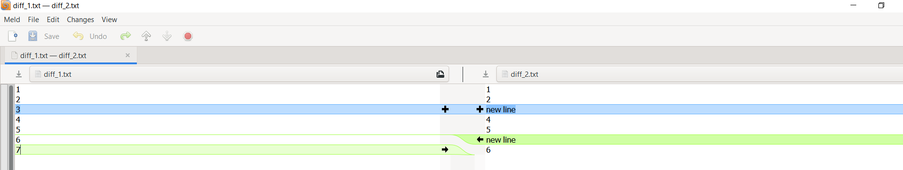

-----

| Title         | Tools TextCompare meld                             |
| ------------- | -------------------------------------------------- |
| Created @     | `2021-12-30T02:51:42Z`                             |
| Last Modify @ | `2022-12-21T15:03:29Z`                             |
| Labels        | \`\`                                               |
| Edit @        | [here](https://github.com/junxnone/linux/issues/4) |

-----

# meld 文件对比工具

## Reference

  - [meld 官网](https://meldmerge.org/)
  - [Code](https://gitlab.gnome.org/GNOME/meld)

## Brief

  - GUI 文件比较工具

## Install

### Install on Ubuntu

    sudo apt install meld

### Install on Windows

  - [download](https://download.gnome.org/binaries/win32/meld/)

## UseCase

