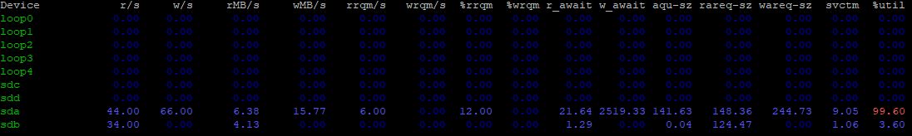

-----

| Title         | Tools OS iostat                                     |
| ------------- | --------------------------------------------------- |
| Created @     | `2019-05-27T02:27:08Z`                              |
| Last Modify @ | `2022-12-22T01:23:03Z`                              |
| Labels        | \`\`                                                |
| Edit @        | [here](https://github.com/junxnone/linux/issues/45) |

-----

# iostat IO性能监控

## Reference

  - [linux硬盘IO性能-iostat](https://www.cnblogs.com/louis-w/p/8027388.html)

## Brief

  - iostat

## UseCase

  - `iostat` 查看硬盘读写状态

<!-- end list -->

``` 
 iostat -d -x -m 1
```


