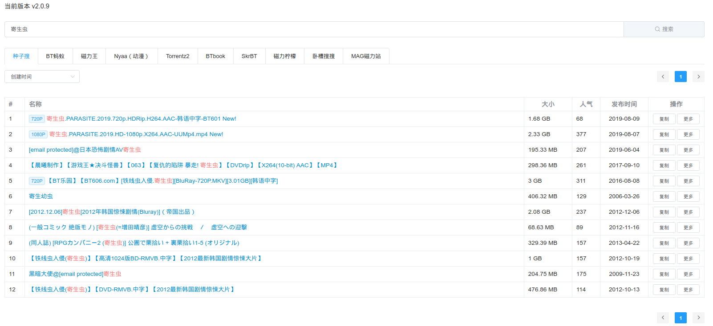

-----

| Title         | Ubuntu Download magnetW                             |
| ------------- | --------------------------------------------------- |
| Created @     | `2019-08-09T12:50:28Z`                              |
| Last Modify @ | `2022-12-21T10:48:49Z`                              |
| Labels        | \`\`                                                |
| Edit @        | [here](https://github.com/junxnone/linux/issues/55) |

-----

# magnetW 磁力下载工具

## Reference

  - [Github](https://github.com/dengyuhan/magnetW)
  - [Docker](https://hub.docker.com/r/gowah/magnetw-web)
  - [种子 / 磁力聚合搜索平台：magnetW
    安装教程](https://www.moewah.com/archives/2112.html)

## Brief

  - 支持磁力搜素

## Docker Install

    docker run --restart=always --name magnetw -d -p 8081:8080 gowah/magnetw-web:latest
    docker restart magnetw

> 不知为什么，需要重启，才能访问

