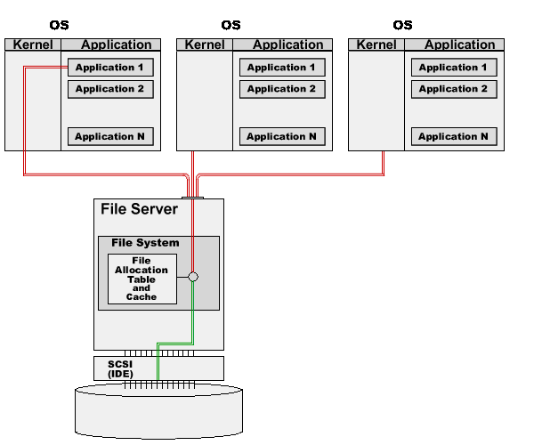
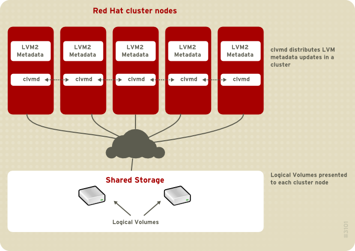

-----

| Title         | FileSystem Format                                   |
| ------------- | --------------------------------------------------- |
| Created @     | `2020-02-01T09:01:13Z`                              |
| Last Modify @ | `2022-12-22T04:17:14Z`                              |
| Labels        | \`\`                                                |
| Edit @        | [here](https://github.com/junxnone/linux/issues/81) |

-----

# 文件系统格式

## Reference

  - [存储系统科普——文件系统介绍](https://www.cnblogs.com/xuanku/p/io_fs.html)
  - [文件系统的对比 -
    wikipedia](https://zh.wikipedia.org/wiki/%E6%96%87%E4%BB%B6%E7%B3%BB%E7%BB%9F%E7%9A%84%E5%AF%B9%E6%AF%94)
  - [文件系统列表 -
    wikipedia](https://zh.wikipedia.org/wiki/%E6%96%87%E4%BB%B6%E7%B3%BB%E7%BB%9F%E5%88%97%E8%A1%A8)

## Brief

## History

| 发布年份 | 文件系统             | 原操作系统                           |
| ---- | ---------------- | ------------------------------- |
| 1984 | FAT16            | PC DOS 3.0/MS-DOS 3.0           |
| 1992 | ext              | Linux                           |
| 1993 | ext2             | Linux, Hurd                     |
| 1993 | NTFS Version 1.0 | Windows NT 3.1                  |
| 1994 | XFS              | IRIX                            |
| 1996 | FAT32            | Windows 95b\[4\]                |
| 1999 | ext3             | Linux                           |
| 1999 | JFS              | OS/2 Warp Server for e-business |
| 2000 | GFS              | Linux                           |
| 2001 | NTFS Version 3.1 | Windows XP                      |
| 2002 | OCFS             | Linux                           |
| 2002 | Lustre           | Linux                           |
| 2003 | ext3cow          | Linux                           |
| 2004 | ZFS              | Solaris                         |
| 2005 | OCFS2            | Linux                           |
| 2006 | ext4             | Linux                           |
| 2006 | GFS2             | Linux                           |
| 2007 | Btrfs            | Linux                           |

## 分类

| 类型      | 相关 FS                                                     | 用途                                       | 缺点                  |
| ------- | --------------------------------------------------------- | ---------------------------------------- | ------------------- |
| 单机文件系统  | Ext2 Ext3 Ex4 NTFS FAT FAT32 XFS JFS | 用于操作系统和应用程序的本地存储                         | 数据无法在机器之间共享         |
| 网络文件系统  | NFS CIFS                                               | 实现不同服务器之间文件系统数据网络共享                      | 两台服务器不能同时访问修改，性能有限  |
| 集群文件系统  | GFS(Redhat) GFS2(Redhat) OCFS(Oracle)               | 共享存储, 通过集群锁实现不同服务器共用传统文件系统               | 性能一般，扩展性很有限         |
| 分布式文件系统 | lustre(Oracle) HDFS(ASF) gluster(Redhat)            | 数据跨服务器分布, 集成 RAID 保护, 多服务器同时访问、修改同一个文件系统 | 适用场景单一，部分类型存在单点故障风险 |

-----

**IO 模型**

| 类型      | IO 模型                                                                                                                                                                                        |
| ------- | -------------------------------------------------------------------------------------------------------------------------------------------------------------------------------------------- |
| 单机文件系统  |                                                                                                                        |
| 网络文件系统  |                                                                                                                             |
| 集群文件系统  |                                                              |
| 分布式文件系统 |    |
