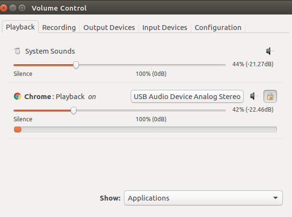

-----

| Title         | Ubuntu Issues USBHeadphoneNoSound                   |
| ------------- | --------------------------------------------------- |
| Created @     | `2018-12-01T18:03:19Z`                              |
| Last Modify @ | `2022-12-22T07:49:20Z`                              |
| Labels        | \`\`                                                |
| Edit @        | [here](https://github.com/junxnone/linux/issues/96) |

-----

# USB 耳机没声音

## Solution

    sudo apt install pavucontrol
    pavucontrol

如图，选择 USB Device

