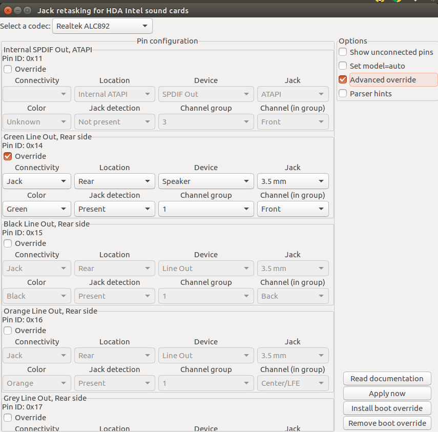

-----

| Title         | Ubuntu Issues FrontHeadPhoneNotWorking               |
| ------------- | ---------------------------------------------------- |
| Created @     | `2019-04-21T04:40:44Z`                               |
| Last Modify @ | `2022-12-22T07:54:26Z`                               |
| Labels        | \`\`                                                 |
| Edit @        | [here](https://github.com/junxnone/linux/issues/101) |

-----

# 前置耳机不工作

## Reference

  - [Ubuntu 16.04 headphones are not
    working](https://askubuntu.com/questions/914608/ubuntu-16-04-headphones-are-not-working)

## Setup rear input

    sudo apt install alsa-tools-gui
    sudo hdajackretask

