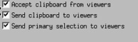

-----

| Title     | Tools Remote vncserver                               |
| --------- | ---------------------------------------------------- |
| Created @ | `2019-01-14T05:35:17Z`                               |
| Updated @ | `2023-08-01T02:50:53Z`                               |
| Labels    | \`\`                                                 |
| Edit @    | [here](https://github.com/junxnone/linux/issues/103) |

-----

# VNC Tools

  - VNC - `Virtual Network Computing` Linux 远程访问 Desktop
  - VNC 由AT\&T 的剑桥研究实验室开发，可实现远程图像显示和控制。
  - Tools
      - TigerVNC
      - TightVNC
      - TurboVNC
      - RemoteVNC
      - RealVNC
      - vino/vinagre
      - x11vnc
  - RFB protocol - `remote framebuffer protocol`

## Ubuntu Install tightvncserver

    sudo apt install  tightvncserver

## Desktop Setup

### xfce4

    sudo apt install xfce4 xfce4-goodies

  - `~/.vnc/xstartup`

<!-- end list -->

    mkdir -p ~/.vnc
    vi ~/.vnc/xstartup

    #!/bin/bash
    xrdb $HOME/.Xresources
    startxfce4 &

    sudo chmod +x ~/.vnc/xstartup

### Gnome

#### `/etc/vnc/xstartup`

    sudo mkdir /etc/vnc

    #!/bin/sh
    
    test x"$SHELL" = x"" && SHELL=/bin/bash
    test x"$1"     = x"" && set -- default
    
    unset SESSION_MANAGER
    unset DBUS_SESSION_BUS_ADDRESS
    
    vncconfig -iconic &
    "$SHELL" -l << EOF
    export XDG_SESSION_TYPE=x11
    export GNOME_SHELL_SESSION_MODE=ubuntu
    dbus-launch --exit-with-session gnome-session --session=ubuntu
    EOF
    vncserver -kill $DISPLAY

    sudo chmod +x /etc/vnc/xstartup
    sudo chmod 777 /etc/vnc/xstartup

#### `~/.vnc/xstartup`

    #!/bin/sh
    [ -x /etc/vnc/xstartup ] && exec /etc/vnc/xstartup
    [ -r $HOME/.Xresources ] && xrdb $HOME/.Xresources

    chmod +x ~/.vnc/xstartup

#### `/etc/systemd/system/vncserver@1.service`

``` 
[Unit]
Description=Start TigerVNC server at startup
After=syslog.target network.target

[Service]
Type=simple
User=your_username
Group=your_username
#PAMName=login
WorkingDirectory=/home/your_username

PIDFile=/home/your_username/.vnc/%H:590%i.pid
ExecStartPre=-/bin/sh -c "/usr/bin/vncserver -kill :%i > /dev/null 2>&1"
ExecStart=/usr/bin/vncserver -fg -depth 24 -geometry 1920x1080 -localhost no :%i
ExecStop=/usr/bin/vncserver -kill :%i

[Install]
WantedBy=multi-user.target

```

    sudo systemctl daemon-reload
    sudo systemctl enable vncserver@1.service
    sudo systemctl start vncserver@1
    sudo systemctl status vncserver@1

## UseCase

### 设置密码

    vncpasswd

### 打开一个server 1920 x 1080

    vncserver -geometry 1920x1080

### 查看启动的 vncserver

    ps -ef |grep vnc

### Kill VNCServer

    vncserver -kill :1

> 1 是 编号/端口

## Connect

  - 使用 `vncviewer` 连接 IP:Port `xxx.xxx.xx.xxx:n`

> n 从 5901 开始

## Issues

### 显示复选框



  - `vi ~/.vnc/xstartup`
  - 添加 `gnome-session &`
  - reboot

## Reference

  - [vncviewer](https://www.realvnc.com/en/connect/download/viewer/)
  - [TigerVNC](https://tigervnc.org/)
  - [vnc简介](https://github.com/levinit/itnotes/blob/main/vnc.md)
  - [Virtual Network Computing -
    wikipedia](https://en.wikipedia.org/wiki/Virtual_Network_Computing)
  - [RFB protocol](https://en.wikipedia.org/wiki/RFB_protocol)
  - [How to Install and Configure VNC on
    Ubuntu 22.04](https://www.digitalocean.com/community/tutorials/how-to-install-and-configure-vnc-on-ubuntu-22-04)
  - [VNC Server setup on Ubuntu 22.04
    LTS](https://gist.github.com/indyfromoz/739cd53d47b91ba1d3b540ab53b1f46c)
  - [Running VNC on Ubuntu 20.04 with default window
    manager](https://www.nodinrogers.com/post/2021-11-15-connecting-to-ubuntu-via-vnc-default-wm/)
