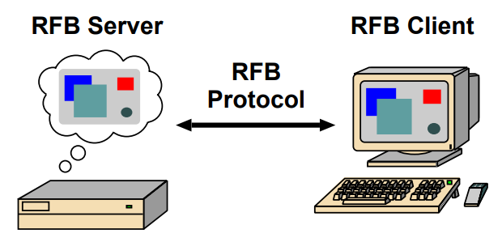

-----

| Title     | Linux VNC                                            |
| --------- | ---------------------------------------------------- |
| Created @ | `2021-10-26T09:06:55Z`                               |
| Updated @ | `2023-06-07T12:38:34Z`                               |
| Labels    | \`\`                                                 |
| Edit @    | [here](https://github.com/junxnone/linux/issues/105) |

-----

# VNC System

  - VNC - Virtual Network Computing/Virtual Network Console - 图形桌面共享系统
  - VNC 由AT\&T 的剑桥研究实验室开发，可实现远程图像显示和控制。
  - RFB protocol - `remote framebuffer protocol`

## RFB Protocol

  - 1998 V3.3
  - 2003 V3.7
  - 2007 v3.8
  - 2011 IETF RFC

## Reference

  - [vnc简介](https://github.com/levinit/itnotes/blob/main/vnc.md)
  - [Virtual Network Computing -
    wikipedia](https://en.wikipedia.org/wiki/Virtual_Network_Computing)
  - [RFB protocol](https://en.wikipedia.org/wiki/RFB_protocol)
