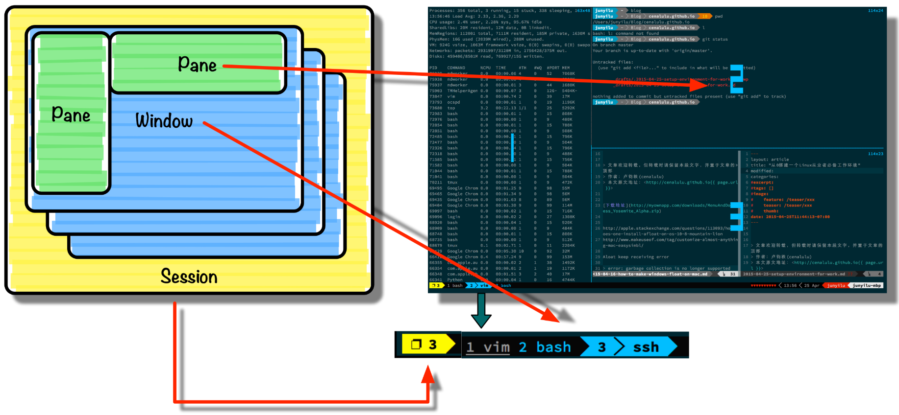

-----

| Title         | Tools Remote tmux Arch                               |
| ------------- | ---------------------------------------------------- |
| Created @     | `2019-08-27T03:40:09Z`                               |
| Last Modify @ | `2022-12-27T05:24:26Z`                               |
| Labels        | `enhancement`                                        |
| Edit @        | [here](https://github.com/junxnone/linux/issues/111) |

-----

## Reference

  - [为什么使用tmux](https://www.cnblogs.com/itech/archive/2012/12/17/2822170.html)
  - [tmux wiki](https://github.com/tmux/tmux/wiki)

## Brief

  - C/S架构 确保任务可以继续执行

## 层属关系

  - Sessions - 可以包含多个 `Windows`
      - Windows - 可以包含多个 `Panes`
          - Panes

<!-- end list -->

    (0)  - session_1: 2 windows
    (1)  ├─> + 0: bash- (3 panes)
    (2)  └─> + 1: bash* (2 panes)
    (3)  - session_2: 1 windows
    (4)  └─> + 0: bash* (2 panes)
    (5)  - session_3: 1 windows (attached)
    (6)  └─> + 0: bash* (2 panes)

  - 可以使用如下对应关系工作:
      - `Session` - `Project`
      - `Windows` - `Task`
      - `Pane` - `Details`
