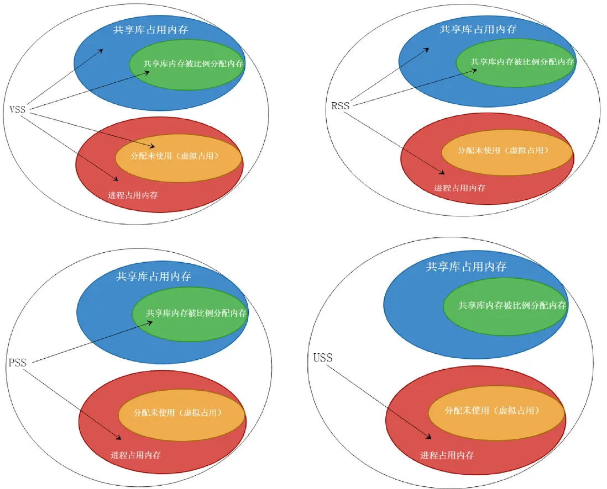

-----

| Title     | Tools OS Memory                                      |
| --------- | ---------------------------------------------------- |
| Created @ | `2023-10-26T02:45:07Z`                               |
| Updated @ | `2024-01-29T08:15:09Z`                               |
| Labels    | \`\`                                                 |
| Edit @    | [here](https://github.com/junxnone/linux/issues/125) |

-----

# Memory 监测工具

  - top
  - htop
  - free
  - [Valgrind ](https://valgrind.org/)
  - \[vtune\]

## VSS/RSS/PSS/USS

  - VSS \>= RSS \>= PSS \>= USS



### VSS - Virtual Set Size

进程向系统申请的虚拟内存（包含共享库内存总数），即单个进程全部可访问的地址空间，其大小可能包括还尚未在内存中驻留的部分。

### RSS - Resident Set Size

是进程在 RAM 中实际保存的总内存（包含共享库占用的共享内存总数）。

即单个进程实际占用内存大小，RSS
可能会产生误导，因为包含了共享库占用的共享内存总数。然而实际上一个共享库仅会被加载到内存中一次，无论被多少个进程使用。

所以，RSS 不能准确的表示单个进程的内存占用情况。

### PSS - Proportional Set Size

是单个进程运行时实际占用的物理内存（包含比例分配共享库占用的内存）。

对比 RSS 来说，PSS 中的共享库内存是按照比例计算的。一个共享库有 N 个进程使用，那么该库比例分配给 PSS 的大小为：1/N；

PSS 明确的表示了单个进程在系统总内存中的实际使用量。

### USS - Unique Set Size

是进程实际独自占用的物理内存（不包含共享库占用的内存）。USS 揭示了单个进程运行中真实的内存增量大小。如果单个进程终止，USS
就是实际返还给系统的内存大小。

当怀疑某个进程中内存泄漏时，可以查看 USS 的数值。

## 查看应用最大使用内存

  - 这里用的是 GNU time `/usr/bin/time`，不是 built-in function `time`

<!-- end list -->

    /usr/bin/time --verbose [your_app]

> example: `/usr/bin/time --verbose du -h`

``` 

        Command being timed: "xxxxx"
        User time (seconds): 33.65
        System time (seconds): 2.73
        Percent of CPU this job got: 738%
        Elapsed (wall clock) time (h:mm:ss or m:ss): 0:04.92
        Average shared text size (kbytes): 0
        Average unshared data size (kbytes): 0
        Average stack size (kbytes): 0
        Average total size (kbytes): 0
      * Maximum resident set size (kbytes): 3190636
        Average resident set size (kbytes): 0
        Major (requiring I/O) page faults: 78
        Minor (reclaiming a frame) page faults: 726357
        Voluntary context switches: 472
        Involuntary context switches: 222
        Swaps: 0
        File system inputs: 2760
        File system outputs: 0
        Socket messages sent: 0
        Socket messages received: 0
        Signals delivered: 0
        Page size (bytes): 4096
        Exit status: 0
```

  - **Maximum resident set size** : 该应用实际使用最大物理内存（包含共享库占用的全部内存）

## Reference

  - [Linux 内存中VSS、RSS、PSS、USS
    介绍](https://segmentfault.com/a/1190000040077427)
