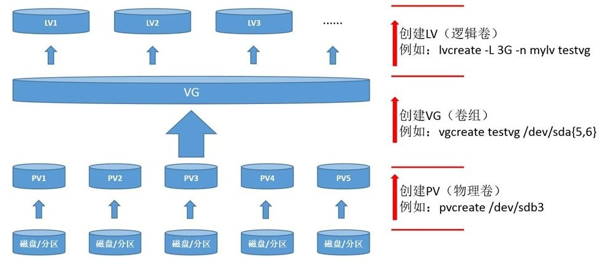

-----

| Title     | Linux LVM                                            |
| --------- | ---------------------------------------------------- |
| Created @ | `2024-08-12T00:45:48Z`                               |
| Updated @ | `2024-08-12T00:50:11Z`                               |
| Labels    | \`\`                                                 |
| Edit @    | [here](https://github.com/junxnone/linux/issues/131) |

-----

# LVM

  - LVM
  - **PV** 就是建立在物理磁盘和磁盘分区之上一个层，它可以把磁盘的分区或 Raid 阵列创建为 PV 层，只有创建为 PV
    后才可以作为 LVM 的基础使用。
  - **VG** 是将单个或多个 PV 组成的一个卷组，卷组共享这些 PV 的总空间，一个 VG 对于 LVM
    来说就相当于一块虚拟的磁盘，只是这个磁盘我们可以通过调整参与的 PV
    灵活的调整整个 VG 的可用空间，这是 LVM 的核心特点。
  - **LV** 相当于在 VG 之上真正创建出来的分区，这个分区最终挂载到文件系统中来直接使用

## Reference

  - [安装 Linux 系统（如 Ubuntu）时将 LVM
    改为使用所有磁盘空间](https://blog.vgot.net/archives/installl-linux-with-lvm-all-disk-space.html)
